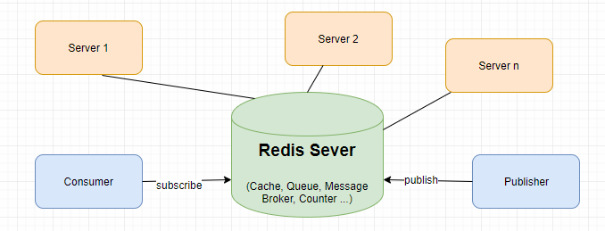

# Setting và ứng dụng Database Redis

## Redis
- `redis`(REmote DIctionary Server) là một mã nguồn mở được dùng để lưu trữ dữ liệu có cấu trúc, có thể sử dụng như một database, bộ nhớ cache hay một message broker.Nó là hệ thống lưu trữ dữ liệu với dạng KEY-VALUE rất mạnh mẽ và phổ biến hiện nay. Redis nổi bật bởi việc hỗ trợ nhiều cấu trúc dữ liệu cơ bản như:hash, list, set, sorted set, string… Tất cả dữ liệu được ghi và lưu trên ram, do đó tốc độ đọc ghi dữ liệu rất là nhanh.
  
  

## Ứng dụng
- `Caching` Sử dụng làm bộ nhớ đệm. Chính tốc độ đọc ghi nhanh mà Redis có thể làm bộ nhớ đệm, nơi chia sẻ dữ liệu giữa các ứng dụng hoặc làm database tạm thời. Ngoài ra Redis có thể sử dụng để làm Full Page Cache cho website. Cũng vì tính nhất quán của Redis, cho dù restart Redis thì người dùng cũng không có cảm nhận chậm khi tải trang.
- `Counter` Sử dụng làm bộ đếm. Với thuộc tính tăng giảm thông số rất nhanh trong khi dữ liệu được lưu trên RAM, sets và sorted sets được sử dụng thực hiện đếm lượt view của một website, các bảng xếp hạng trong game chẳng hạng. Redis hỗ trợ thread safe do đó nó có thể đồng bộ dữ liệu giữa các request.
- `Publish/Suscribe (Pub/Sub)` Tạo kênh chia sẻ dữ liệu. Redis hỗ trợ tạo các channel để trao đổi dữ liệu giữa publisher và subscriber giống như channel trong Socket Cluster hay topic trong Apache Kafka. Ví dụ: Pub/Sub được sử dụng theo dõi các kết nối trong mạng xã hội hoặc các hệ 
- `Queues` Tạo hàng đợi để xử lý lần lượt các request. Redis cho phép lưu trữ theo list và cung cấp rất nhiều thao tác với các phần tử trong list, vì vậy nó còn được sử dụng như một message queue.

## Các kiểu dữ liệu trong Redis
- STRING
- LIST
- SET
- HASH
- SORTED SET (ZSET)
## Setting 
- Windows

    + Bước 1: Truy cập [Github](https://github.com/microsoftarchive/redis/releases) để dowload Packages phù hợp
    + Bước 2: Cài bản `Redis-x64-3.2.100.msi` hoặc `Redis-x64-3.2.100.zip` 
    + Bước 3: Start `redis-server.exe` và `redis-cli.exe` để thực hiện thao tác trên `redis`
  
## Triển Khai  Code (nodejs with express)

- npm instal `redis` and `require` 
-  Create Redis Client
```
let client = redis.createClient();
client.on('connect', function () {
    console.log('Connected to Redis...');
});
```
- Add/Update(hmset)

```
  client.hmset(id, [
        'first_name', first_name,
        'last_name', last_name,
        'email', email,
        'phone', phone
    ],  (err, reply)=> {
        if (err) {
            console.log(err);
        }
        console.log(reply);
        res.status(200).send('done');
    });
  Examples 
  HMSET myhash field1 "Hello" (Hello  = input)
  "OK" (return)
```

- Search(hgetall)

```
client.hgetall(id,  (err, obj) =>{
        if (!obj) {
            res.status(400).send('User khong ton tai')
        } else {
            obj.id = id;
            res.status(200).send({user: obj})
        }
    });
    Examples 
    HSET myhash field1 "Hello"
    (integer) 1
    HGETALL myhash
    "Hello"
```
- delete(del)
```
 client.del(req.params.id);
    res.status(200).send('da xoa thanh cong')
    Examples
    SET key1 "Hello"
    "OK"
    DEL key1
    (integer) 1
```
